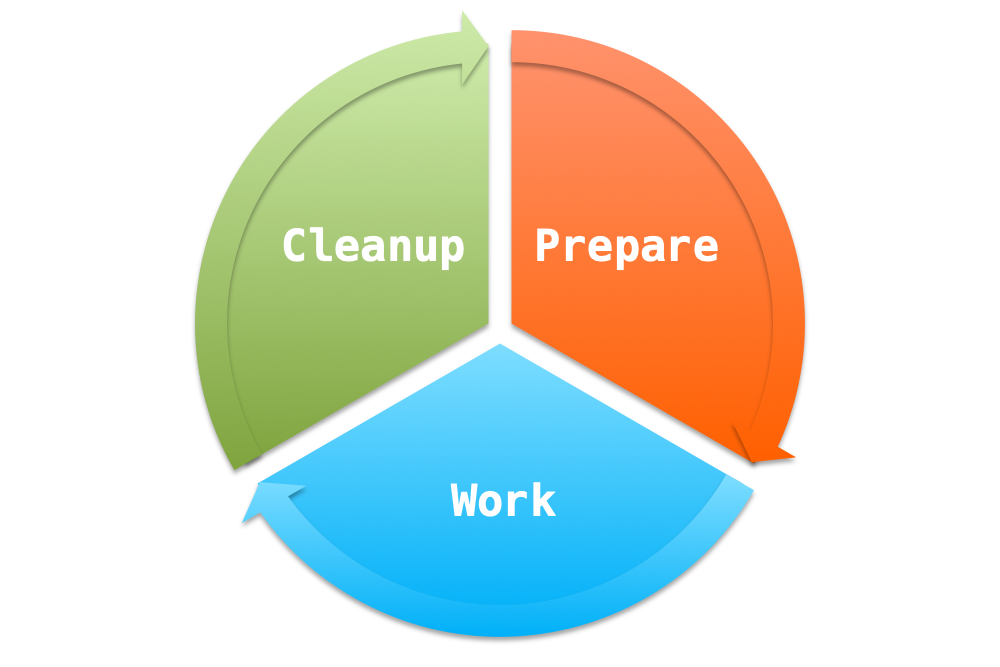
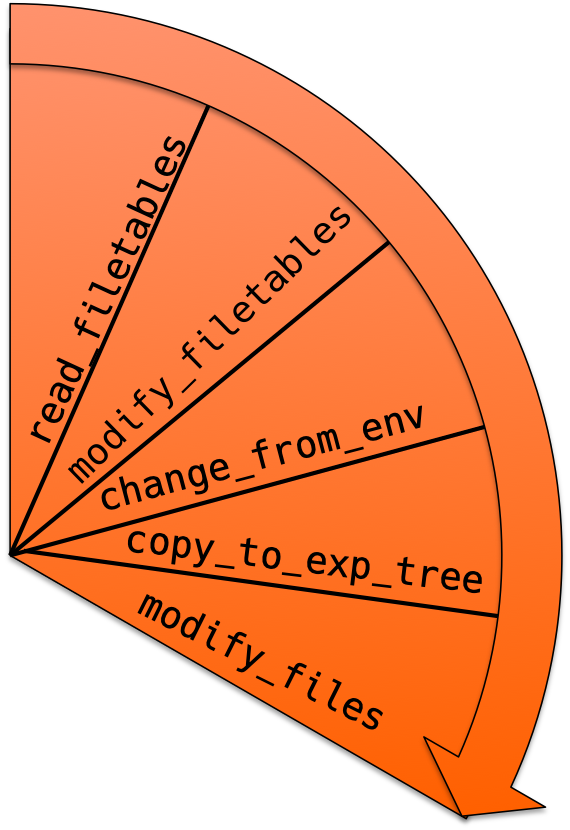
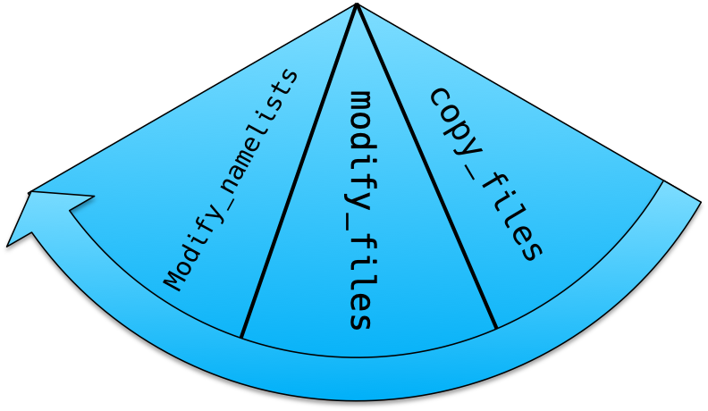

.. _Dev_05:

#####################
Dev: Simulation Cycle
#####################

Each component is able to perform a simulation by dividing it into discrete
*phases*: preperation, work, and cleanup. In turn, these phases are divided
into *steps*, which move files into appropriate locations, modify namelists,
and ensure everything is ready for an execution. After the execution, the result
outdata and restart files are moved to appropriate locations.

In principle, the "simulation cycle" looks like this:

We briefly describe what happens during each of these phases.

The Prepare Phase
-----------------

During the :meth:`prepare <pyesm.component.ComponentCompute.prepare>` phase,
the following steps are performed:

#. The default filetables are read:
   ``<Component.Name>_<Component.Version>_prepare_default_files.json``.
#. Next, if it exists, a modification table is read.
#. Finally, the filetable keys are used to read from the environment and change
   the source of certain files.
#. These files are copied to the experiment tree
#. Any modifications are performed that may be needed. **Here, you should
   implement things that might modify namelists, or perform hotfixes on restart
   files**

Note that before and after each of these steps, users may attach self-defined
methods. The image above only gives the "short" names of the methods (with the
exception of ``change_from_env``, this is actually called
:meth:`override_filetables_from_env
<pyesm.component.ComponentCompute._prepare_override_filetables_from_env>`, but
that wouldn't fit in the image). The full names always take the form
``_prepare_<method short name>``. All of these steps are performed if the
method ``prepare`` is called on an object that inherits from
:class:`ComponentCompute <pyesm.component.ComponentCompute>`:

.. code-block:: python

   >>> from random_clouds.random_clouds_simulation import RandomCloudsCompute
   >>> computable_clouds = RandomCloudsCompute(*args)  # Note that *args should be something appropriate.
   >>> computable_clouds.prepare()
   >>> # Calling computable_clouds._prepare_read_filetables()
   >>> # Calling computable_clouds._prepare_modify_filetables()
   >>> # Calling computable_clouds._prepare_override_filetables_from_env()
   >>> # Calling computable_clouds._prepare_copy_files_to_exp_tree()
   >>> # Calling computable_clouds._prepare_modify_files()

The Work Phase
--------------

The :meth:`work <pyesm.component.ComponentCompute.work>` phase by default does
the following steps:

#. Copies files from the experiment tree to the work folder
#. Modifies files in the work folder if needed
#. Modifies namelists in the work folder if needed

In the basic :class:`ComponentCompute <pyesm.component.ComponentCompute>`
case, only the first step actually does any work. Modification of files and
namelists needs to be implemented specifically for each component. 

.. attention::

   Currently, copying of files into work directory pops off the files from the
   dictionary, since after the work phase, the cleanup phase loads new
   dictionaries into :attr:`ComponentCompute.files
   <pyesm.component.Component.files>`, thus after this step the file
   dictionaries are empty.

As before, if the :meth:`work <pyesm.component.ComponentCompute.work>` phase is
called, this would happen:

.. code-block:: python

   >>> from random_clouds.random_clouds_simulation import RandomCloudsCompute
   >>> computable_clouds = RandomCloudsCompute(*args)  # Note that *args should be something appropriate.
   >>> computable_clouds.work()
   >>> # Calling computable_clouds._work_copy_files()
   >>> # Calling computable_clouds._work_modify_files()
   >>> # Calling computable_clouds._work_modify_namelists()

The Cleanup Phase
-----------------

The :meth:`cleanup <pyesm.component.ComponentCompute.cleanup>` phase consists
of a single step, moving files from the work folder
to the outdata and restart directories, and setting appropriate names. A new
filetable is read
``<Component.Name>_<Component.Version>_cleanup_default_files.json``: 

Calling the :meth:`cleanup <pyesm.component.ComponentCompute.cleanup>` method would look like this:

.. code-block:: python

   >>> from random_clouds.random_clouds_simulation import RandomCloudsCompute
   >>> computable_clouds = RandomCloudsCompute(*args)
   >>> computable_clouds.cleanup()
   >>> # Calling computable_clouds._cleanup_copy_files()

Here, certain strings are replaced, as was described in the previous section.
The rules for these replacements are contained in a small csv file, which can
be unique to each component. If you need any specific replacements, you can add
them to the list. The current replacement rules are summarized in the table:

.. csv-table:: String Interpolation during Cleanup
   :file: ../../../pyesm/component/component_simulation_replacement_rules.csv
   :delim: ;
   :widths: auto
   :align: center

Next, we will work through designing a :class:`SetUp <pyesm.setup.SetUp>` object, which controls the
simulation of several connected ``Component``\s

----

Previous: :ref:`Dev_04`

Next: :ref:`Dev_06`
